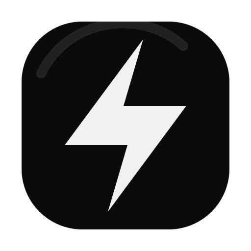
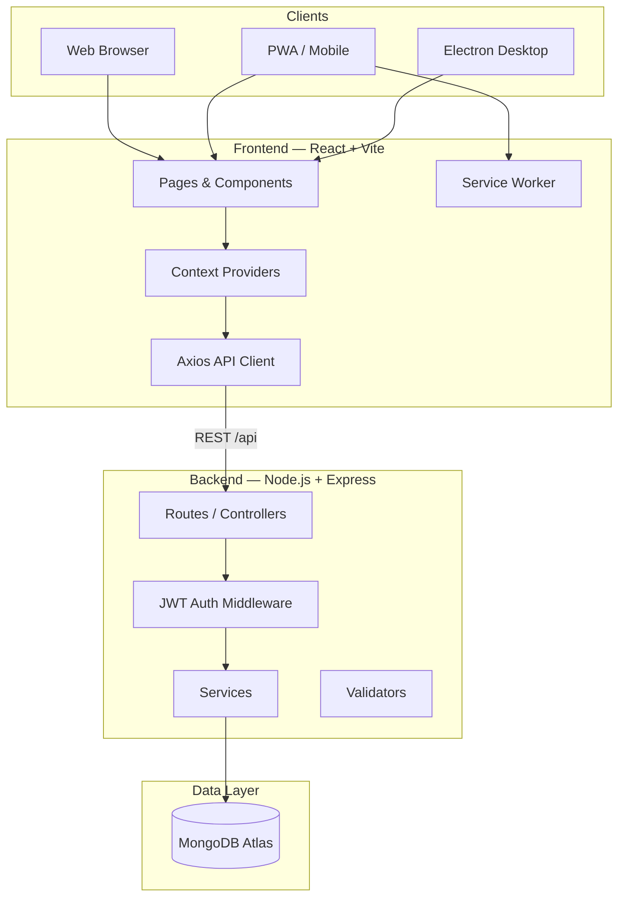

<p align="center">
  
</p>

<h1 align="center">Gotta-do-it (GDI)</h1>

<p align="center">
  <strong>Personal Productivity Ecosystem</strong><br/>
  Desktop + mobile synchronized productivity — tasks, goals, focus, analytics, and cloud sync.
</p>

<p align="center">
  <a href="https://github.com/Sahil689172/GDI"></a>
  
  
  
  
  
  
  
</p>

<p align="center">
  <b>Author:</b> <a href="https://github.com/Sahil689172">Sahil Poply</a>
</p>

---

## Screenshots

<p align="center">
  
</p>
<p align="center"><em>Command Center — your productivity hub at a glance</em></p>

<p align="center">
  
  &nbsp;
  
</p>
<p align="center"><em>Tasks & workspaces · Goals & milestones</em></p>

<p align="center">
  
  &nbsp;
  
</p>
<p align="center"><em>Analytics & focus · Cloud sync across devices</em></p>

---

## Overview

**Gotta-do-it (GDI)** is a premium, monochrome personal productivity ecosystem built to unify how you plan, execute, and measure your work across **laptop and phone**.

### Vision

One calm, focused environment for everything that matters: daily tasks, long-term goals, deep work sessions, and honest analytics — without juggling disconnected apps.

### Problem solved

Most productivity tools are either **web-only** (weak on desktop) or **local-only** (no real sync). GDI combines:

- A **beautiful React SPA** with native-feeling motion and layout
- A **secure Express API** with per-user data isolation
- **MongoDB Atlas** for reliable cloud persistence
- **Electron** for a dedicated desktop experience
- **PWA** install support for phone home-screen access
- A **sync layer** so laptop ↔ phone stay aligned, with offline-friendly queues

### Personal productivity ecosystem

| Layer | Role |
|-------|------|
| **Tasks & workspaces** | Organize work by context, priority, and drag-and-drop boards |
| **Goals** | Track milestones, streaks, and progress rings |
| **Focus** | Pomodoro-style sessions with history and stats |
| **Analytics** | Charts, heatmaps, and productivity insights |
| **Calendar** | Schedule and visualize events |
| **Notifications** | Smart reminders and an in-app notification center |
| **Sync** | Push/pull with conflict-aware `updatedAt` handling |

### Desktop + mobile sync

Sign in once with **JWT**. Your data lives in **MongoDB Atlas**. Use **manual sync** or automatic retries when back online — the same account on desktop (Electron) and mobile (installed PWA).

---

## Features

### Tasks & Workspaces

- Full **task CRUD** (create, edit, complete, delete)
- **Drag & drop** ordering via `@dnd-kit`
- **Priorities** and filtering
- Multiple **workspaces** for context switching
- Optimistic updates with **offline queue** support

### Goals

- Goal **CRUD** with categories and deadlines
- **Progress tracking** and milestone steps
- **Streak badges** and history
- **Goal analytics** (weekly trends, overview stats)
- Progress rings and timeline views

### Analytics

- **Productivity insights** dashboard
- **Charts** (completion, focus trends, productivity) via Recharts
- **Streak tracking** across goals and habits
- **Activity heatmap** for visual patterns
- Period filters and empty states

### Focus Mode

- **Pomodoro-style timer** with presets
- **Focus sessions** (start/end API-backed)
- **Session history** and statistics
- Fullscreen focus mode with ambient UI
- Quotes and completion overlays

### Notifications

- Server-generated **reminders** (tasks, goals, streaks, deadlines)
- **Unread tracking** and mark-all-read
- In-app **notification center** + bell in topbar
- `POST /api/notifications/generate` for refresh

### Sync System

- **MongoDB Atlas** cloud persistence
- **Laptop ↔ phone** synchronization via `/api/sync`
- **Manual sync** button + status indicators
- **Offline-ready** architecture (local queue, device ID header)
- Conflict checks using `updatedAt` timestamps

### Authentication

- **JWT** access tokens + httpOnly cookie option
- **Protected routes** on frontend and `protect` middleware on API
- Strict **user isolation** — all queries scoped to `req.user._id`
- Login, signup, profile, and logout flows

### Desktop App

- **Electron** wrapper (`electron/main.js`, secure preload)
- Custom **lightning brand icon** (generated from `assets/brand/lightning.svg`)
- Tray, native window, dev/prod URL loading
- Packaged builds via `electron-builder` → `release/`

### Mobile App

- **PWA** with service worker precaching (`vite-plugin-pwa`)
- **Install to home screen** (Android Chrome, iOS Safari)
- Fully **responsive** layout (mobile nav, drawer, touch-friendly UI)
- Works against the same deployed API as desktop

---

## Architecture



| Tier | Stack |
|------|--------|
| **Frontend** | React 18, Vite 5, Tailwind CSS, Framer Motion, React Router |
| **Backend** | Node.js, Express.js, Mongoose, express-validator |
| **Database** | MongoDB Atlas |
| **Auth** | JWT (Bearer + optional cookie) |
| **Desktop** | Electron 41 |
| **Mobile** | PWA (manifest + Workbox) |

**Request flow:** UI → Context → `services/*Api.js` → `/api` (proxied in dev) → Express route → controller → service → Mongoose model → Atlas.

---

## Project Structure

```
GDI/
├── src/                    # React frontend application
│   ├── api/                # Axios client, interceptors, auth headers
│   ├── animations/         # Framer Motion presets & micro-interactions
│   ├── components/         # UI by domain (tasks, goals, focus, analytics, …)
│   ├── context/            # React context providers (auth, sync, tasks, …)
│   ├── hooks/              # Reusable hooks (analytics, media query, search)
│   ├── layouts/            # App shell — sidebar, topbar, page transitions
│   ├── pages/              # Route-level pages (lazy-loaded)
│   ├── providers/          # Composed provider tree (AppProviders.jsx)
│   ├── routes/             # AppRoutes + navigation config
│   ├── services/           # API modules (authApi, tasksApi, syncApi, …)
│   ├── styles/             # Global CSS (calendar, auth, responsive)
│   ├── ui/                 # Shared primitives (modals, loaders, cards)
│   └── utils/              # Helpers (auth storage, device ID, errors)
│
├── backend/                # Express REST API
│   └── src/
│       ├── config/         # env, database connection
│       ├── controllers/    # Request handlers per resource
│       ├── middleware/     # auth, validation, errors, rate limit
│       ├── models/         # Mongoose schemas (User, Task, Goal, …)
│       ├── routes/         # Express routers mounted at /api
│       ├── services/       # Business logic (auth, sync, notifications)
│       ├── utils/          # JWT, API responses, reminder engine
│       └── validators/     # express-validator rule sets
│
├── electron/               # Desktop app shell
│   ├── main.js             # Window, tray, load Vite URL or dist
│   ├── preload.cjs         # Secure context bridge (CommonJS)
│   └── assets/             # Generated multi-size PNG icons
│
├── public/                 # Static assets (favicon, PWA icons, manifest)
├── public1/                # README screenshots (marketing / docs)
├── assets/                 # Source brand assets (lightning.svg)
├── scripts/                # Icon generator (generate-icons.mjs)
├── docs/                   # Additional documentation (cleanup report, etc.)
├── dist/                   # Vite production build (gitignored)
└── release/                # electron-builder output (gitignored)
```

### Folder reference

| Path | Purpose |
|------|---------|
| `src/components/` | Feature UI — `tasks/`, `goals/`, `focus/`, `analytics/`, `calendar/`, `notifications/`, `sync/`, `pwa/` |
| `src/context/` | Global state — `AuthContext`, `TasksContext`, `GoalsContext`, `SyncContext`, … |
| `src/services/` | Thin API wrappers used by contexts |
| `src/routes/` | `AppRoutes.jsx` (lazy routes), `navigation.js` (nav items) |
| `backend/src/controllers/` | Map HTTP requests to service calls |
| `backend/src/models/` | `User`, `Workspace`, `Task`, `Goal`, `FocusSession`, `Notification`, `SyncState` |
| `backend/src/middleware/` | `auth.js`, `validate.js`, `errorHandler.js` |
| `backend/src/utils/` | `jwt.js`, `ApiResponse.js`, `reminderEngine.js`, `goalProgress.js` |
| `electron/` | Desktop runtime — loads `http://localhost:3000` in dev or `dist/index.html` in prod |
| `public/` | PWA manifest icons, `favicon.ico` served by Vite |
| `public1/` | Screenshot gallery for README and GitHub |
| `assets/brand/` | Master lightning SVG for icon generation |

---

## Download Desktop Application

> There is **no pre-built public release** in this repository yet. Build locally with the steps below.

### Build locally (Windows / macOS / Linux)

**Prerequisites:** Node.js 18+, npm, and (on Windows) [Developer Mode](https://learn.microsoft.com/en-us/windows/apps/get-started/enable-your-device-for-development) enabled if packaging fails on symlinks.

```bash
# From repository root
npm install
npm run build          # Creates dist/
npm run desktop:build  # Runs electron-builder → release/
```

**Output location:**

| Platform | Typical artifact |
|----------|------------------|
| **Windows** | `release/Gotta-do-it-<version>-win.zip` |
| **macOS** | `release/Gotta-do-it-<version>.dmg` |
| **Linux** | `release/Gotta-do-it-<version>.AppImage` |

Extract the Windows ZIP and run `Gotta-do-it.exe` inside the folder.

### Run in development (no installer)

```bash
# UI only (no API — login/sync need backend)
npm run desktop:dev

# Full stack — API + Vite + Electron
npm run desktop:all
```

### Publishing a GitHub Release (optional)

1. Run `npm run desktop:build`
2. Upload artifacts from `release/` to a [GitHub Release](https://github.com/Sahil689172/GDI/releases)
3. Link the download in this README

---

## Install on Mobile

GDI works as a **Progressive Web App** — install it from your deployed site (e.g. Netlify) for a native-like home screen icon.

### Android

1. Open your **deployed GDI URL** in **Chrome**
2. Tap the menu (⋮) → **Install app** or **Add to Home screen**
3. Confirm — launch **Gotta-do-it** from your home screen like a native app

### iPhone (iOS)

1. Open the deployed URL in **Safari** (required for install)
2. Tap **Share** (□↑)
3. Scroll and tap **Add to Home Screen**
4. Tap **Add** — open GDI from your home screen

> **Tip:** Sign in with the same account as desktop to sync tasks and goals via MongoDB Atlas.

---

## Local Setup

### Prerequisites

- **Node.js** 18 or newer
- **npm** 9+
- **MongoDB Atlas** cluster (or local MongoDB for experiments)
- Git

### 1. Clone the repository

```bash
git clone https://github.com/Sahil689172/GDI.git
cd GDI
```

### 2. Frontend dependencies

```bash
npm install
```

### 3. Backend setup

```bash
cd backend
cp .env.example .env
# Edit .env — set MONGODB_URI, JWT_SECRET, CLIENT_URL
npm install
```

**Verify database connection:**

```bash
npm run db:verify
```

### 4. Run development

**Web + API (recommended):**

```bash
# From repository root
npm run dev:all
```

| Service | URL |
|---------|-----|
| Frontend (Vite) | http://localhost:3000 (or next free port, e.g. 3001) |
| API | http://localhost:5000/api |
| Health check | http://localhost:5000/api/health |

**Frontend only:**

```bash
npm run dev
```

**Backend only:**

```bash
npm run dev:api
# or: cd backend && npm run dev
```

**Desktop:**

```bash
npm run desktop:dev    # Vite + Electron
npm run desktop:all    # API + Vite + Electron (full features)
```

### 5. Environment variables

Create `backend/.env` from `backend/.env.example`:

| Variable | Description |
|----------|-------------|
| `MONGODB_URI` | MongoDB Atlas connection string |
| `JWT_SECRET` | Long random secret for signing tokens |
| `CLIENT_URL` | Comma-separated frontend origins (production) |
| `PORT` | API port (default `5000`) |

> In **development**, `localhost` / `127.0.0.1` on any port is allowed for CORS automatically.

### Production build

```bash
npm run build           # Frontend → dist/
npm run preview         # Preview production build locally
npm run desktop:build   # Package Electron app → release/
```

Backend production:

```bash
cd backend
NODE_ENV=production npm start
```

---

## Deployment

### Frontend → Netlify

1. Connect the GitHub repo to [Netlify](https://www.netlify.com/)
2. **Build command:** `npm run build`
3. **Publish directory:** `dist`
4. Add redirect for SPA routing (`/* /index.html 200`)
5. Set environment variable for API URL if using a custom axios base (default uses relative `/api` — configure Netlify proxy or `VITE_API_URL` if added)

### Backend → Render / Railway

1. Deploy `backend/` as a Node service
2. Set `NODE_ENV=production`, `MONGODB_URI`, `JWT_SECRET`, `CLIENT_URL` (your Netlify URL)
3. Ensure `PORT` matches platform (often injected automatically)
4. Health endpoint: `GET /api/health`

### Database → MongoDB Atlas

1. Create a free cluster at [MongoDB Atlas](https://www.mongodb.com/atlas)
2. Database user + network access (IP whitelist or `0.0.0.0/0` for cloud hosts)
3. Copy connection string into `MONGODB_URI`

### End-to-end checklist

- [ ] Atlas cluster reachable from Render/Railway
- [ ] `CLIENT_URL` includes production frontend URL
- [ ] Strong `JWT_SECRET` in production
- [ ] HTTPS on frontend and API
- [ ] PWA manifest `start_url` matches deployed domain

---

## Scripts reference

| Command | Description |
|---------|-------------|
| `npm run dev` | Vite dev server |
| `npm run dev:api` | Backend with nodemon |
| `npm run dev:all` | Frontend + backend concurrently |
| `npm run build` | Production frontend build + PWA |
| `npm run preview` | Serve `dist/` locally |
| `npm run desktop:dev` | Vite + Electron |
| `npm run desktop:all` | API + Vite + Electron |
| `npm run desktop:build` | Build + electron-builder |
| `npm run icons:build` | Regenerate favicon & app icons |
| `cd backend && npm run db:verify` | Test MongoDB connection |

---

## Future Roadmap

- [ ] **Android widgets** — quick capture and today view from home screen
- [ ] **Desktop widgets** — system tray / Windows widget integration
- [ ] **Advanced sync** — richer conflict resolution and real-time sync
- [ ] **AI productivity assistant** — smart scheduling and task suggestions
- [ ] **Calendar integrations** — Google Calendar, Outlook, iCal two-way sync

---

## Author

**Sahil Poply**

- GitHub: [@Sahil689172](https://github.com/Sahil689172)
- Repository: [github.com/Sahil689172/GDI](https://github.com/Sahil689172/GDI)

---

## License

This project is licensed under the **MIT License**.

Copyright © 2026 Sahil Poply

See the [LICENSE](LICENSE) file for full text.

---

<p align="center">
  <sub>Built with focus. Ship what matters. ⚡</sub>
</p>
